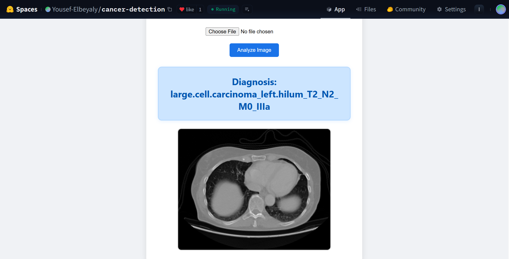

# 🫁 Chest Cancer Detection AI

### A Production-grade MLOps project using CNN and Flask, deployed on Hugging Face.

## 🚀 Live Demo
Check out the live app on Hugging Face Spaces: 
[**Click Here to Try the App**](https://huggingface.co/spaces/Yousef-Elbeyaly/cancer-detection)

## 📷 Application Interface
Here is a preview of the web application in action:

  

## 🛠️ Tech Stack
- **Backend:** Flask (Python)
- **AI Model:** TensorFlow / Keras (CNN)
- **Deployment:** Hugging Face Spaces
- **Frontend:** HTML5, CSS3 (Responsive Design)

## 🧐 How it Works
1. Upload a Chest X-ray image (PNG/JPG).
2. The model processes the image (Resized to 224x224).
3. The AI predicts the type and stage of the cancer (e.g., Squamous Cell Carcinoma, TNM Staging).
4. Instant results are displayed in a clean, user-friendly interface.

## 📁 Project Structure
- `app.py`: The main Flask application.
- `src/`: Contains the prediction pipeline and custom exceptions.
- `templates/`: HTML interface.
- `artifacts/`: Contains the `.h5` model and labels.

## ⚙️ Setup & Installation
1. Clone the repo: `git clone https://github.com/Yousef-Elbeyaly/Chest-Cancer-Classification-MLOps.git`
2. Install dependencies: `pip install -r requirements.txt`
3. Run the app: `python app.py`

### 📁 Test it yourself!
Need an X-ray image to test? Download Sample Images from the [**samples folder**](./Test) (5 images of each cancer type).
